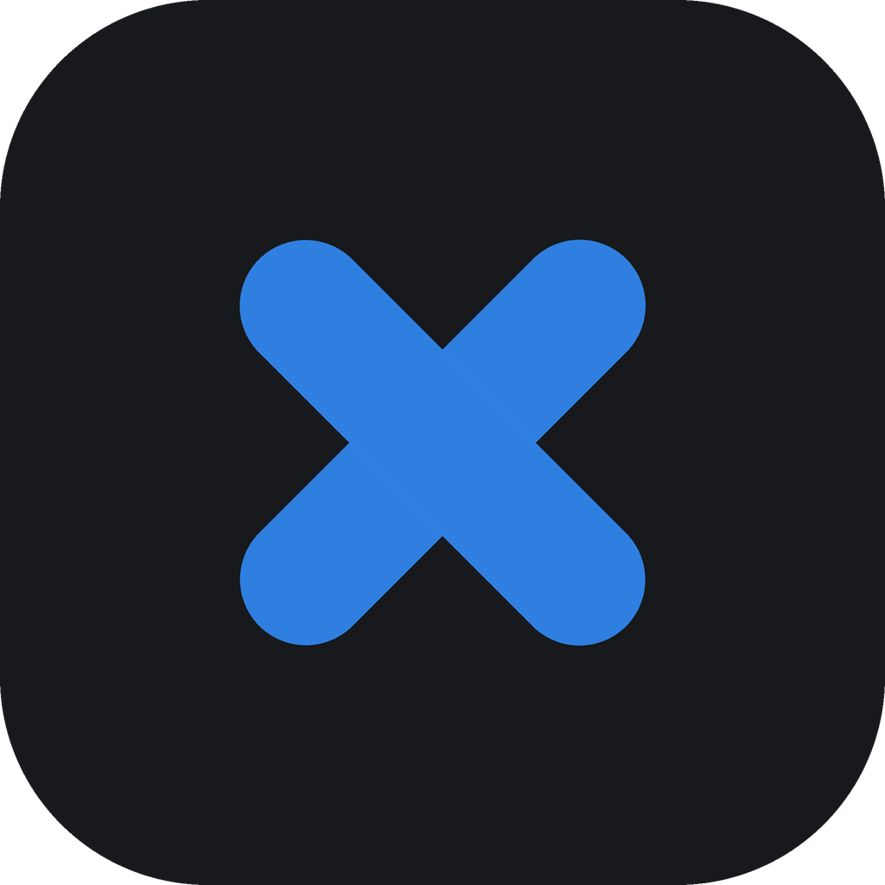

  

<h1 align="center">eximaro&trade;</h1>

<b>Turn a Raspberry Pi or an old PC into a screen that can run from your phone.</b> Free for nonprofits &amp; personal use. Offline, no accounts, no subscription.

## What do you want to do?

- 🆕 **[Set up a new device →](docs/INSTALL.md)**
- 🔁 **[Update a device →](docs/UPDATE.md)**
- 🩺 **[Troubleshoot / check a device →](docs/TROUBLESHOOTING.md)**

## What you'll need

A **Raspberry Pi 4 or 5** with **Raspberry Pi OS Lite (64‑bit)**, or a **64‑bit PC** with **Debian 13** — no desktop needed. Plus a screen to plug it into.

New device with nothing on it yet? First **[get an operating system on it](docs/GET-AN-OS.md)**.

## How it works

One device is the **controller** — you open its web panel from your phone and manage everything. The others are **displays** — screens that show what the controller sends. Every device runs the same software; you pick the role when you install.

## Prefer we set it up for you?

Don't want to do it yourself? We offer a paid, done-for-you service — we supply the devices, set everything up on-site, and hand it over ready to run. **Request a quote at [eximaro.com](https://eximaro.com).** Pricing varies with device prices and the travel distance for setup.

---

## License

Eximaro is **source‑available under the [PolyForm Noncommercial License 1.0.0](./LICENSE)** — free for noncommercial use, and deliberately not an open‑source license.

- ✅ **Free, forever, for any noncommercial use** — churches, schools, nonprofits, government, public health &amp; safety organizations, and personal or hobby use. Run it on as many screens as you like. You may also **share it and modify it** for noncommercial purposes.
- 💼 **Commercial use requires a license** from Consecrated Tech — any for‑profit business running it, and anyone selling devices with it preloaded. **For commercial terms, contact us at [eximaro.com](https://eximaro.com).**
- 🔒 **The commercial right stays with Consecrated Tech.** No one may sell, monetize, or charge for the software or any fork of it; every copy must keep the copyright notice; and the **Eximaro** name (a trademark) can't be used on a fork.

**Eximaro™** is a trademark of Consecrated Tech; the license grants no rights to the name or logo — see [NOTICE.md](./NOTICE.md). This project uses **python‑zeroconf** (LGPL‑2.1) as an installed dependency — its license is in [`LICENSES/python-zeroconf-COPYING`](./LICENSES/python-zeroconf-COPYING).

Why it's built the way it is: [LAWS.md](./LAWS.md).
